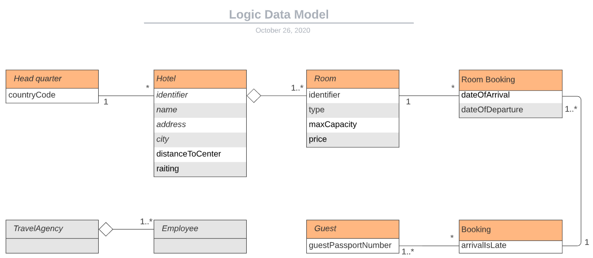

### LogicalDataModel

### Nouns 
|Names |LDM   | Explenation |
|------|:----:|-------------|
|Hotel | x |             |
|Head quarter | x |             |
|Holiday|-||
|System|-||
|Rooms | x ||
|Web-Servive|-||
|Third part solution|||
|Employees| x ||
|Travel-Agency| ? ||
|Agrement| ? ||
|Identification| x  |by 8 letters, the first two letters should be ISO_3166 country code and the last five characters are a 6 didgit number|
|Hotel-Name| x ||
|Adresse| x |||
|distence| x ||
|Cities| x ||
|Rating| x ||
|Room-Number| x ||
|Room-Code| x | 1 to 4 digits followed by an optional letter from a-z|
|Room-accomodatom| x |max number of guest|
|Room-Type| x |types: 'S'single, 'D' double, 'T' twin2, 'F' family, and 'M' meeting room|
|Prices| x |Price per room|
|Passport_Number| x |guest identifacation|
|Bookings| x |1 or more guest. Booking can include one or more rooms. Number of guest not > then max capacity of room|
|Bookings-nights| x ||
|Late arrival| x ||
|Capacity-Room| x ||
|Meetingrooms| x |Meeting rooms can only be booked in connection with a stay, the capacity of the meeting rooms can not be used for accommodation.|

