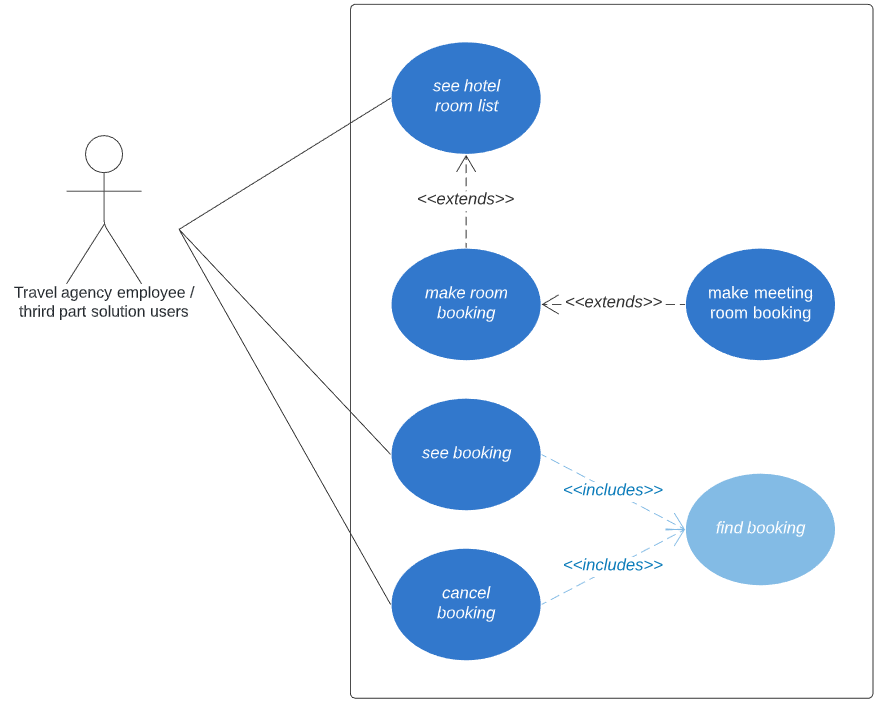

### USE CASE

### Verbs

|Names            |LDM           | Explenation |
|-----------------|:------------:|-------------|
|Identified |-|
|Invole one or more guest|-|
|Include more than one room|-|
|May not be greater than|-|
|Only be booked in connection with a stay|(x)|
|Can not be used for accommodation|-|
|Should be marked with "late arrival"|-|
|Tasks should be handled by the web application|-|
|Show a list of vacant hotel rooms|x|
|Should include hotel information and type of rooms|-|
|Make a booking|x|
|Include af meeting room|x|
|An error message should be returned|-|
|See a booking (passport)|x|
|Cancel a booking (passport)|x|

## Main Use Cases

**Prime actor:** System user: Travel agency employee / third part solution users  

### Use-case 1
#### System user makes a booking.

**Secondary Actor:** NONE  

**Main Success Scenario:** System user makes successfull booking.

1. System user selects find hotel rooms from search form.
2. System user fill out search form
3. System user recives a list of vacant hotel rooms in a given city for a given number of guests and period of time.

**Extension:** Make room booking
**Pre-conditions:** Must have a list of vacant hotel rooms

1. System user selecet vacant hotel room
2. System user books the hotel room

**Extension:** Add meeting room to booking
**Pre-conditions:** Must have a booked room in hotel.

1. System user make an extended booking on a meeting room

* * *

**Secondary Scenario nr. 1:**  
**Pre-conditions:** Agency employee/api makes successfull booking through an booking api with meeting room.     

1. Actor can get a list of vacant hotel rooms in a given city for a given number of guests and period of time.
2. Actor can make a booking for up to 9 persons in one or more rooms for a given period of time on a given day
3. Actor makes a booking of a meeting room
4. See booking

**Secondary Scenario Nr. 2:**  Agency employee/api cancels a booking  
**Pre-conditions:** Must have a booking  

1. Actor finds booking
2. Actor cancels the booking
